# Lab02 - Quản Lý Mảng Số Nguyên (C# Console App)

**Học phần:** 2611COMP101904 - Lập trình trên Windows  
**Sinh viên thực hiện:** Lê Trần Anh Khoa | **MSSV:** 51.01.104.044 | **Lớp:** 51.01.CNTT.C

---

## 📌 Tính Năng Chính

* **Vòng lặp Menu điều khiển linh hoạt**: Hiển thị danh sách chức năng từ `0` đến `7`, tự động quay lại menu sau khi xử lý xong một tính năng cho tới khi người dùng chọn `0` để thoát.
* **Xác thực dữ liệu đầu vào (Validation)**:
  * **Chặn thao tác khi chưa nhập mảng**: Ngăn chặn người dùng chọn các chức năng tính toán/xử lý (`2` đến `7`) khi mảng chưa được khởi tạo (`mang == null`).
  * **Ép kiểu dữ liệu an toàn**: Sử dụng `int.TryParse` để chặn các trường hợp nhập ký tự, chuỗi hoặc để trống gây lỗi chương trình.
  * **Ràng buộc kích thước mảng**: Bắt buộc số lượng phần tử n phải là số nguyên dương (n > 0).
* **Xử lý tác vụ trên mảng số nguyên**:
  1. **Nhập mảng**: Khởi tạo mảng và nhập từng phần tử a[i].
  2. **Xuất mảng**: In toàn bộ các phần tử hiện có ra màn hình.
  3. **Tính tổng**: Tính tổng giá trị của toàn bộ các phần tử trong mảng.
  4. **Tìm Max/Min**: Tìm và hiển thị giá trị lớn nhất và giá trị nhỏ nhất trong mảng.
  5. **Đếm chẵn/lẻ**: Thống kê số lượng phần tử là số chẵn và số lẻ.
  6. **Sắp xếp tăng dần**: Sắp xếp mảng theo thứ tự tăng dần và xuất lại kết quả sau khi sắp xếp.
  7. **Tìm kiếm**: Nhập giá trị x và trả về chỉ số (index) đầu tiên tìm thấy x trong mảng.

---

## 🛠 Giải Thích Các Hàm Cốt Lõi

* `NhapSoNguyen(string message)`: Đọc dữ liệu từ Console và dùng `int.TryParse` để lặp lại yêu cầu cho đến khi người dùng nhập đúng số nguyên hợp lệ.
* `NhapSoNguyenDuong(string message)`: Tái sử dụng `NhapSoNguyen`, đồng thời bắt buộc giá trị nhập vào phải > 0.
* `NhapMang()`: Gọi `NhapSoNguyenDuong` để lấy số lượng phần tử n, sau đó khởi tạo mảng `int[n]` và nhập từng phần tử a[i].
* `XuatMang(int[]? a)`: Kiểm tra mảng khác `null` và dùng vòng lặp `for` để in các phần tử cách nhau bởi khoảng trắng.
* `TinhTong(int[]? a)`: Sử dụng vòng lặp `foreach` để cộng dồn giá trị của từng phần tử.
* `TimMax(int[]? a)` / `TimMin(int[]? a)`: Khởi tạo giá trị lớn nhất/nhỏ nhất bằng `a[0]` và duyệt mảng để so sánh, cập nhật kết quả.
* `DemChan(int[]? a)` / `DemLe(int[]? a)`: Duyệt mảng bằng `foreach` và kiểm tra điều kiện chia hết cho 2 (`item % 2 == 0` hoặc `!= 0`).
* `SapXepTangDan(int[]? a)`: Sử dụng phương thức tích hợp `Array.Sort(a)` để sắp xếp mảng tăng dần trực tiếp.
* `TimKiem(int[]? a, int x)`: Duyệt qua mảng bằng vòng lặp `for`, trả về chỉ số `i` ngay khi gặp phần tử đầu tiên bằng `x`. Nếu không tìm thấy, trả về `-1`.

---

## 📸 Hình Ảnh Kết Quả

### 1. Giao diện Menu chính
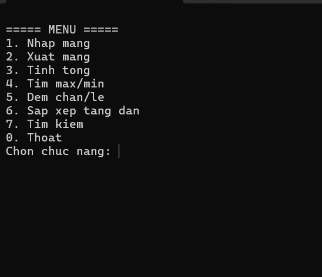  
*Mô tả: Màn hình hiển thị danh sách chức năng từ 0 đến 7 khi bắt đầu chạy chương trình.*

---

### 2. Thông báo lỗi xác thực dữ liệu (Validation)

* **Bắt lỗi thực hiện chức năng khi chưa chọn nhập mảng:**  
  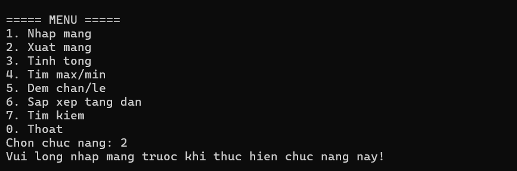  
  *Mô tả: Hiển thị thông báo "Vui long nhap mang truoc khi thuc hien chuc nang nay!" khi chọn các tính năng 2–7 lúc mảng chưa được khởi tạo.*

* **Bắt lỗi nhập sai kiểu dữ liệu (không phải số nguyên):**  
  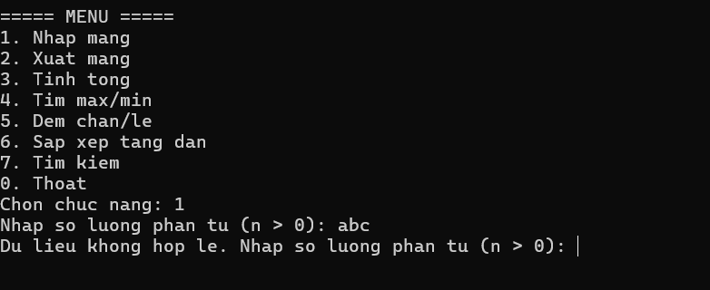  
  *Mô tả: Yêu cầu nhập lại ngay lập tức nếu người dùng nhập chữ hoặc ký tự đặc biệt.*

* **Bắt lỗi nhập số lượng phần tử mảng <= 0:**  
  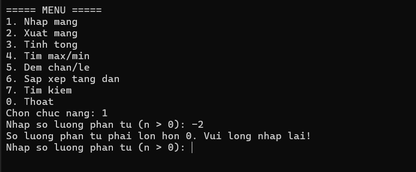  
  *Mô tả: Cảnh báo "So luong phan tu phai lon hon 0" khi người dùng nhập n <= 0.*

* **Bắt lỗi chọn chức năng không có trong Menu:**  
  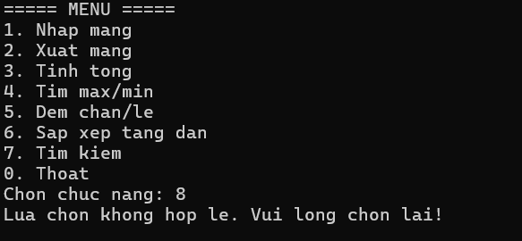  
  *Mô tả: Thông báo "Lua chon khong hop le" khi nhập số nằm ngoài khoảng 0–7.*
* **Bắt lỗi không tìm được giá trị x trong mảng:**  
  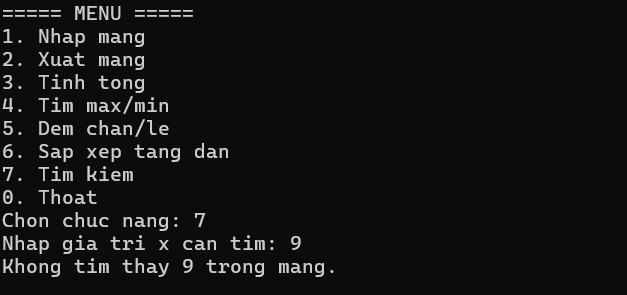  
  *Mô tả: Thông báo "Khong tim thay gia tri x trong mang" khi nhập giá trị x không tồn tại trong mảng.*

---

### 3. Thực thi các chức năng

* **Nhập mảng (Chức năng 1):**  
  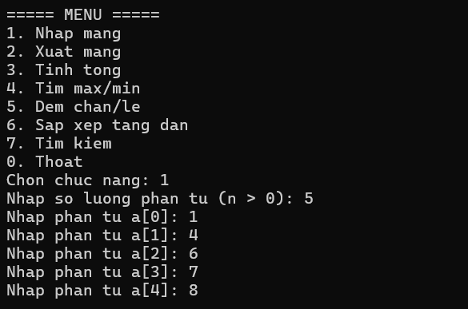  
  *Mô tả: Thực hiện nhập số lượng phần tử n và lần lượt nhập các giá trị cho mảng.*

* **Xuất mảng & Tính tổng (Chức năng 2 & 3):**  
  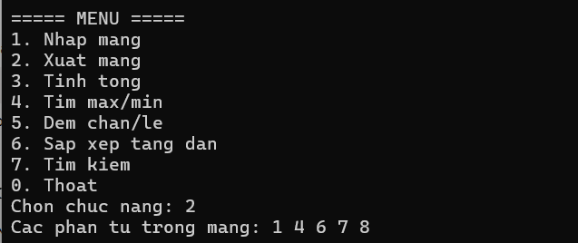  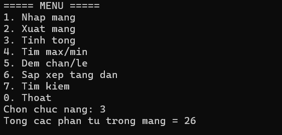
  *Mô tả: In danh sách mảng vừa nhập và hiển thị kết quả tính tổng.*

* **Tìm Max/Min & Đếm chẵn/lẻ (Chức năng 4 & 5):**  
  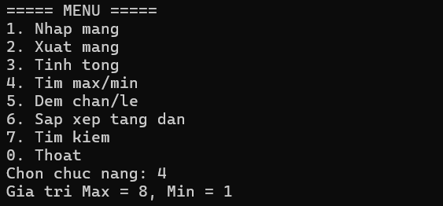  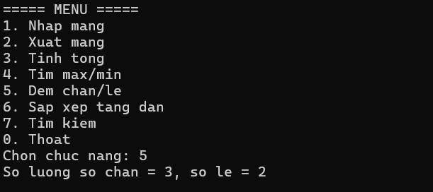
  *Mô tả: Hiển thị phần tử lớn nhất, nhỏ nhất và số lượng các số chẵn, số lẻ có trong mảng.*

* **Sắp xếp tăng dần (Chức năng 6):**  
  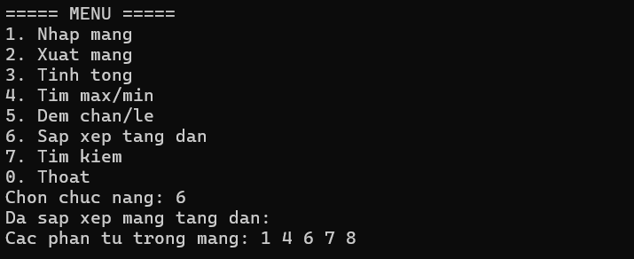  
  *Mô tả: Mảng được sắp xếp lại theo thứ tự tăng dần và in ra màn hình.*

* **Tìm kiếm phần tử x (Chức năng 7):**  
  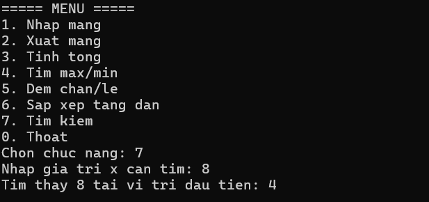  
  *Mô tả: Nhập giá trị x cần tìm và hiển thị vị trí (chỉ số index) đầu tiên tìm thấy x.*

* **Thoát chương trình (Chức năng 0):**  
  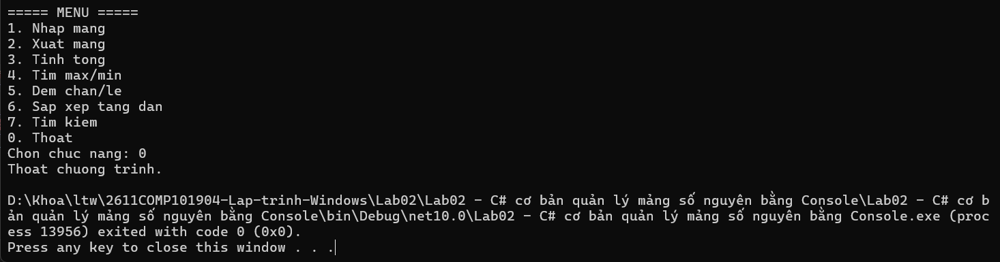  
  *Mô tả: Chọn 0 để kết thúc chương trình và đóng Console.*